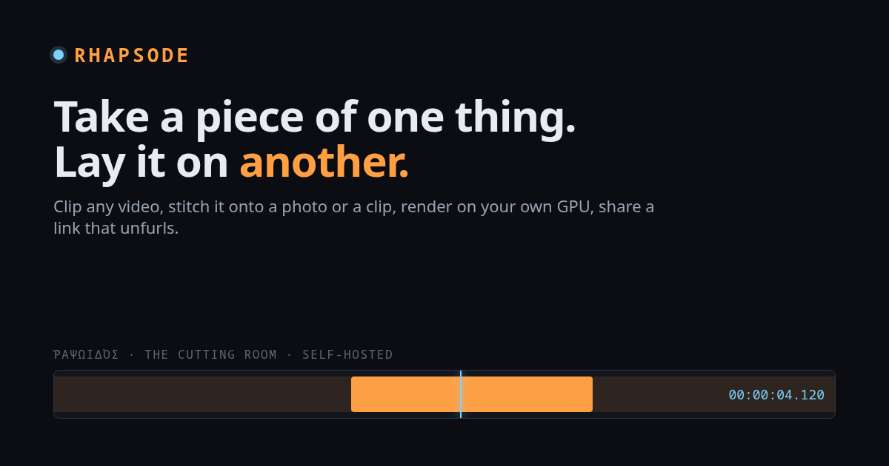
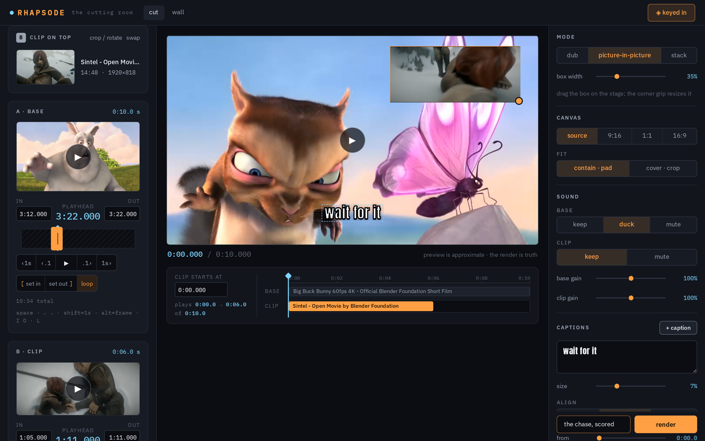
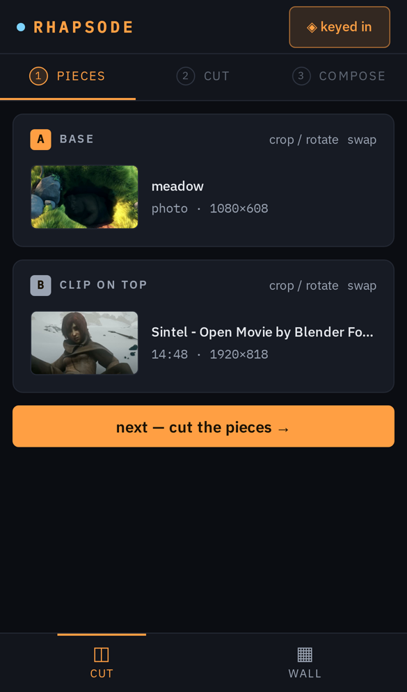
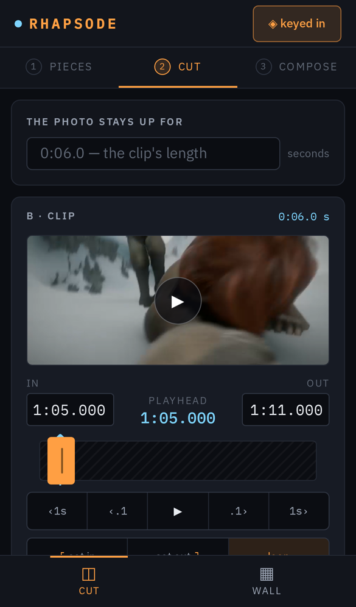
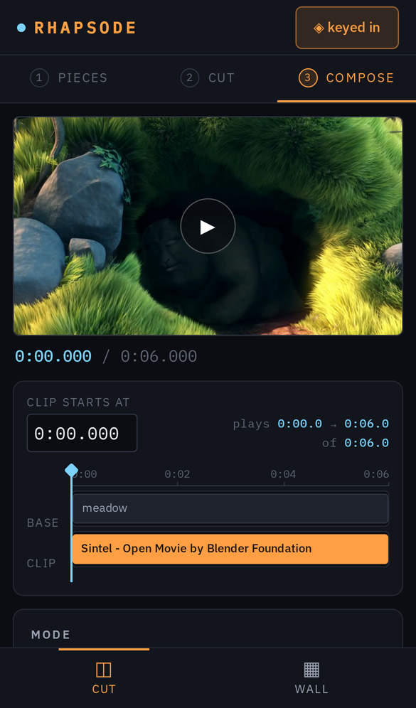

<p align="center">
  
</p>

# Rhapsode

**ῥαψῳδός — the song-stitcher.** Take a piece of one thing and lay it on another.

A self-hosted cutting room. Paste a YouTube link (or X, TikTok, Instagram, Vimeo — anything yt-dlp reads) or drop a clip from your phone, cut the seconds you want, stitch them onto a photo, a clip, or another link, and render on your own GPU. Every render gets a two-word link that unfurls in WhatsApp, Telegram, X and iMessage.

Landing page: **https://zahakj.github.io/rhapsode/**

## Cut

The quick path: a base, a clip on top, and how they meet — **dub** (keep, duck, or mute the base's own sound), **picture-in-picture**, or **stack** — plus outlined captions. Frame-honest trimming with typed in and out points and a keyboard-driven playhead. Works in a minute on a phone.

<p align="center"></p>

## Studio

When two pieces are not enough: any number of video, music and text tracks. Photos that pan and zoom, clips that dissolve into each other, floating boxes with opacity, subtitles with a second line for translations and SRT in and out, a one-click photo montage. Premiere-style shortcuts, right-click menus, dockable panels. Still one recipe, still one ffmpeg command.


## On the phone

<p align="center">
  
  
  
</p>

## Run it

```
cp .env.example .env        # set INVITE_KEY — viewing is public, creating needs the key
npm install
npm run dev:server          # API on :5950
npm run dev                 # UI on :5951
```

Needs Node ≥ 24, `ffmpeg` / `ffprobe` and `yt-dlp` on PATH. Renders use `h264_nvenc` when an NVIDIA GPU answers, `libx264` otherwise.

The done bar: `npm run typecheck && npm test && npm run build && npm run smoke`. The tests render real clips through ffmpeg from generated fixtures; the smoke drives the entire UI in headless Chromium on desktop and phone.

## Shape

Single package: `client/` (Vite + React), `server/` (Hono, run directly by Node's type-stripping — no server build), `shared/` (the zod recipe and sequence schemas both sides speak). Media and a SQLite file live under `data/`.

**The recipe is the whole edit.** `server/render/graph.ts` (two pieces) and `server/render/sequence.ts` (the studio) turn it into one ffmpeg command — pure functions, unit-tested by asserting the argv down to the filter strings — and those are the only render paths. Sources become one original plus one locally derived scrub proxy, so what you trim in the browser is exactly what ffmpeg cuts.

Things the code is careful about, because each one bit once:

- never `-shortest`; output length is an explicit `-t`, every audio lane is padded, every `amix` carries `normalize=0`
- ducking is a sidechain compressor, not a volume step
- a lane the mode wants but the file lacks is replaced by generated silence
- captions go through files; ffmpeg 9's drawtext option order is pinned by a test; fonts are chosen per script so right-to-left text shapes correctly
- yt-dlp player clients are pinned so sectioned fetches of long videos are not refused
- uploads stream to disk while being sniffed and hashed; phone clips are never buffered in memory
- a restart marks in-flight jobs failed; nothing pretends

## Deploy

`deploy/rhapsode.service` is a systemd user unit (sandboxed, with the device rules NVENC needs). The server binds loopback only; put a Cloudflare tunnel or a reverse proxy in front of it. Set `PUBLIC_ORIGIN` so share links carry your domain. Storage is capped (`DISK_CAP_BYTES`, `RENDER_CAP_BYTES`) and old unreferenced sources are swept.

## License

MIT.
